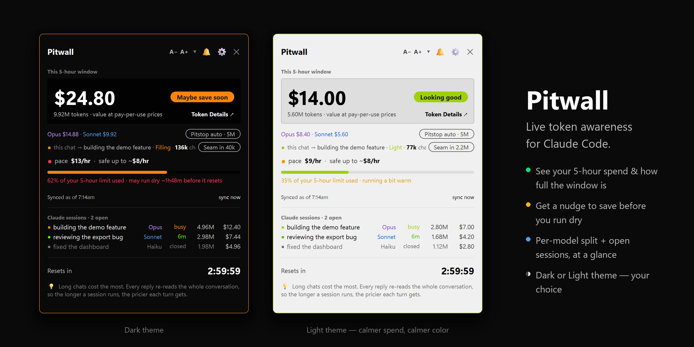
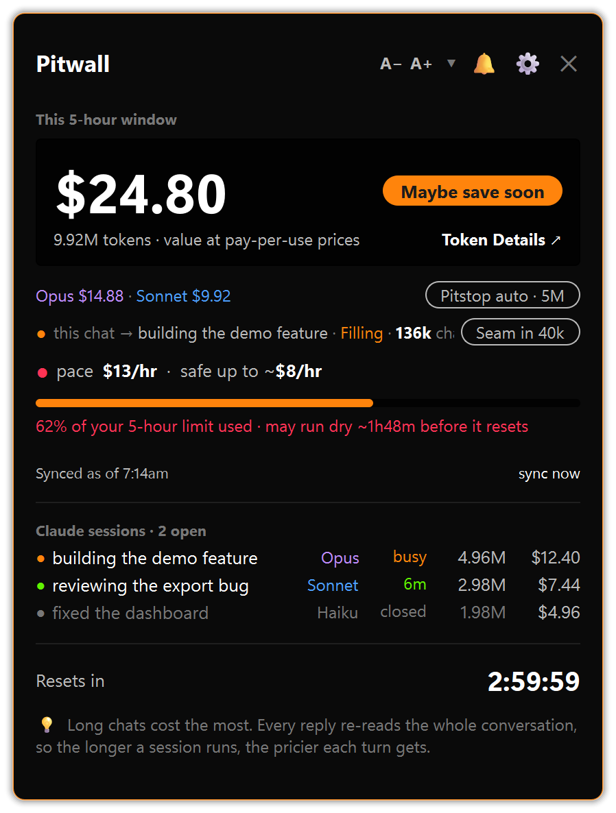
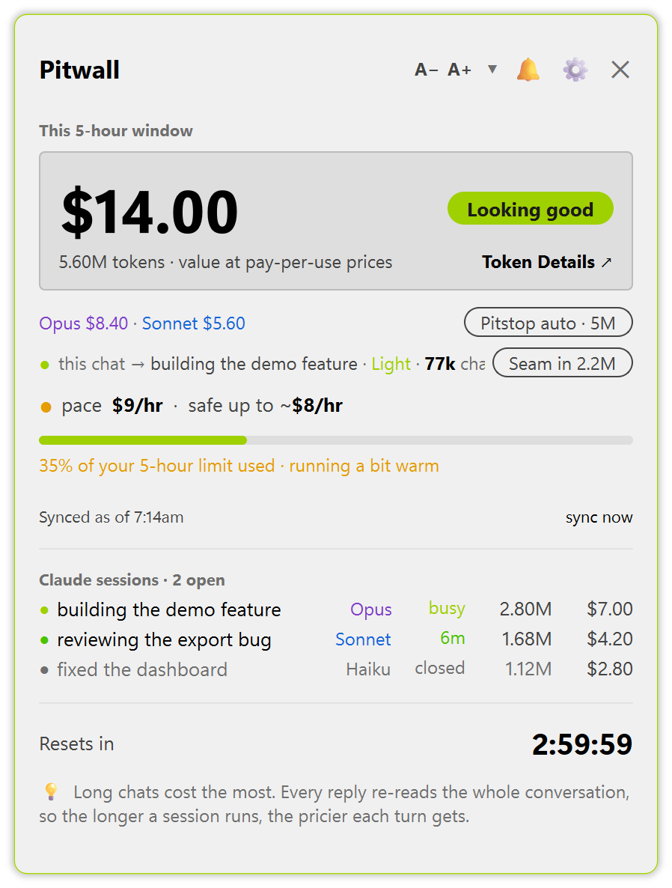
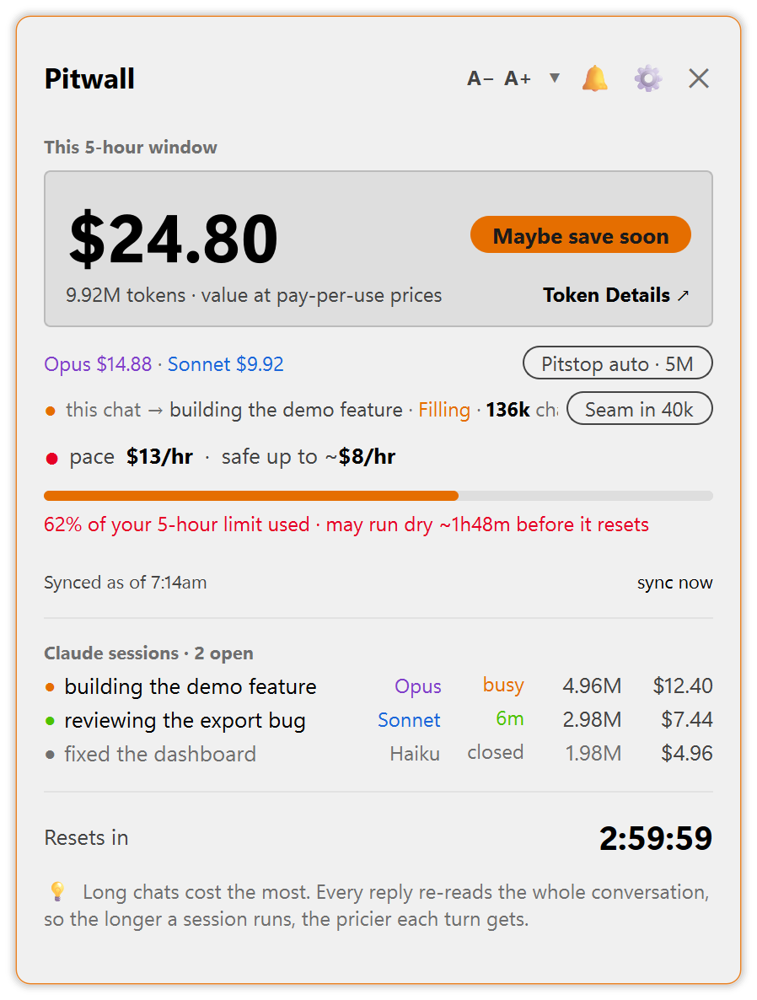
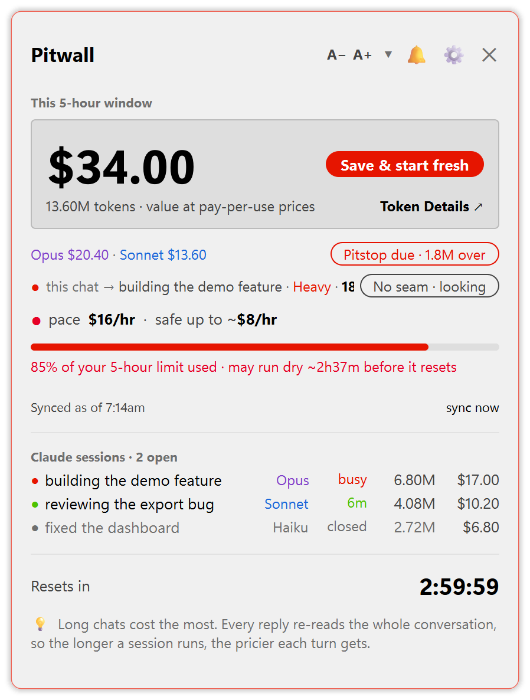
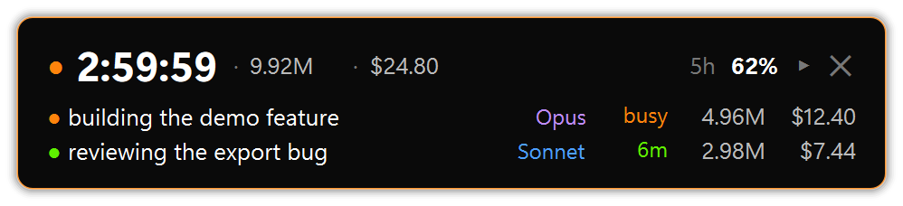

# Pitwall

**Live token awareness for Claude Code.** A small, always-on-top desktop widget
that shows, at a glance, what your Claude Code usage is costing, how close you are
to your limit, and when it's worth restarting fresh.

<p align="center">
  
</p>

It reads your own local Claude Code files and shows you the numbers. **No account,
no sign-in, no telemetry.** Nothing about your usage ever leaves your machine.

> **About the `$`:** on a Claude subscription it is **not a bill** — it's a fuel
> gauge showing what your usage *would* cost at pay-as-you-go API prices, so you
> can see how heavy a session has become. On a metered API key it's a close
> estimate of real cost.

---

## Why it exists

Every Claude Code reply re-reads the **whole conversation so far** — so the longer
a session runs, the more each turn costs, and it's easy to burn through your
allowance without noticing. You usually find out you're near a limit only when
Claude tells you.

Pitwall puts that gauge on your screen so you can see it coming — and makes the fix
(a clean restart) one click away.

---

## What you see

<p align="center">
  
</p>

- **This window** — your spend in the rolling usage window you're in right now, in
  dollars and tokens.
- **By model** — a colour split of where the spend went: Fable · Opus · Sonnet ·
  Haiku, each priced at its own rate.
- **Pace** — a coloured dot for how fast you're burning: green (on track), amber
  (warm), red (projected to run dry early).
- **Will I make the reset?** — one plain-English line: *on track* / *running warm*
  / *may run dry ~1h early* / *used up, wait for the reset*.
- **Resets in** — the countdown to when your allowance refreshes.
- **Your sessions** — each open Claude Code session with its own running cost.
  Pitwall checks the live process list, so "open" means *genuinely* open; rows warm
  from green to red as a chat gets heavier.

### The heat ring

The whole widget glows with how hard you're pushing — the ring around it runs
**green → amber → red** as the heat rises, so you can read the state from the corner
of your eye without focusing on a single number.

<p align="center">
  
  
  
</p>
<p align="center"><em>Calm · Warm · Heavy (shown in Light theme; Dark works too).</em></p>

### Click a session to find its window

Lost track of which terminal a session is running in? **Left-click its row** and
Pitwall throws a coloured ring around the actual terminal window that session lives
in — so you can spot it instantly among a dozen open windows. **Right-click any row**
for a details popup (project folder, model, running cost). A session running in the
background — no window of its own, e.g. one you're driving from your phone — says so
instead of flashing.

### Collapse it to a pill

Tap the collapse control in the header and the whole card shrinks to a single compact
pill that still shows the number that matters; tap again to expand it back.

<p align="center">
  
</p>

### Size the text — A− / A+

Two buttons in the header, **A−** and **A+**, step the whole widget's text up or down
through preset sizes — readable on a dense 4K laptop or from across the room. Each
popup (Settings, session details) remembers its own size independently.

---

## Keeping the numbers honest — Sync

Pitwall's everyday number is an **estimate**, read from your own Claude Code
transcript files. It slowly drifts from Claude's server-side truth (the figures on
**Settings → Usage**). There are two ways to re-pin it to reality — both feed the
same code, so the result is identical either way.

### Automatic sync (opt-in)

Turn it on and Pitwall fetches the real numbers itself, on a schedule — no typing,
no window flashing, **$0 token cost**. It quietly spawns `claude /usage` off-screen,
reads the rendered panel straight out of Claude's own console (no OCR, no misread
digits), pins the result, and tears the process down. Opening `/usage` doesn't spend
tokens, so the whole capture is free.

The cadence adapts to how you're working:

- syncs **on startup** and again **every interval** while you're actively using
  Claude Code;
- **the interval adjusts to the model in use** — it drops to ~10 minutes when
  **Fable** is live (it burns faster), and sits at ~30 minutes otherwise, until you
  set your own interval;
- **pauses while idle** and **resumes instantly** the moment real CLI work picks back
  up; also re-syncs after the machine wakes from sleep.

"Active" is judged by real assistant turns landing in your transcripts — never by
mouse or keyboard — so a desk-bump at 3am can't trigger a capture. It's **off by
default**; the master switch (`auto_usage.enabled`) is also the kill-switch. A
failed capture is silent: it skips that cycle and never corrupts your pinned numbers.

### Manual sync (always available)

Open the **⚙ gear** and type the **"% used"** and **"resets in"** straight from
**Settings → Usage**. Pitwall back-calculates your true ceiling and measures against
that — while still showing its own estimate beside it, so you can watch for drift.

*(The authoritative figures live only on that page, behind your login — there's no
local file or public API for them, which is why this glance, manual or automatic, is
the bridge.)*

---

## Keep the prices current — Rates

Claude Code logs how many tokens you use, but not the dollar prices — so Pitwall
ships its own price table. When Anthropic changes prices, update them in the widget:
**⚙ gear → Accuracy → Rates → View & update rates**. Type the new Input and Output
price per million tokens for each model and save — no code editing. A built-in link
jumps straight to Anthropic's current price page, and Pitwall stamps when you last
checked.

---

## Everything in the gear (⚙ Settings)

Click the **⚙** in the header to open Settings — a left rail of panes, each a short
scroll. The full map:

**Identity** — what the widget calls itself and how it sits on your desktop.
- **Display name** + an optional **tagline** (the header text).
- **Theme** — **System** (copy whatever Windows is set to and follow along when
  Windows flips, e.g. on a scheduled night switch), **Dark**, or **Light**. Applies
  instantly.
- **Window** — **Always stay on top** (float above every other window) and **Start
  with Windows** (launch automatically when you sign in).

**Accuracy** — keep the numbers honest.
- **Your plan** — Free / Pro / Max 5× / Max 20×; Pitwall estimates your limits from
  it until a sync brings the real figures.
- **Rates** — opens the price editor (see [Rates](#keep-the-prices-current--rates)).
- **Manual set** — type the real **% used** and **resets in** from Settings → Usage
  (see [Sync](#keeping-the-numbers-honest--sync)), plus the weekly-limit fields.

**Attention** — when the widget speaks up.
- **Save nudges** — opt-in: tap you when a chat has grown expensive enough that a
  fresh start would save money. It only shows a tip with the exact text to type — it
  never types or runs anything itself.
- **Rotating tips** — show or hide the rotating tips along the bottom of the card.

**Diagnostics** — see how Pitwall behaves, safely.
- **Demo** — open a second, clearly-badged **DEMO** Pitwall driven by a slider, so
  you can watch the whole card react without touching your real data.
- **Auto-sync real usage** — the master on/off switch, the resync interval, a **Sync
  now** button for a one-shot capture, and **Troubleshoot capture** (a read-only
  window showing exactly what the off-screen `/usage` read pulled in).

**Pitstop** — *(appears only when the optional pitstop toolchain is installed)* the
switches for how a relaunched session starts (see [The pitstop](#the-pitstop--save-your-place-restart-fresh)).

A version number sits quietly at the bottom of the rail. **Save · Clear · Cancel** are
pinned along the footer.

---

## The pitstop — save your place, restart fresh

The single highest-impact habit with Claude Code is the **pitstop**: when a session
gets heavy, save your progress to memory and start a fresh one. The new session is
light, fast and cheap — and you keep the thread.

Pitwall offers three levels, from one manual click to fully hands-off.

### ↻ one-click (in the widget)

Next to each open session is a **↻** button:

1. It reminds you to type **`save progress to memory`** in that window (only that
   window can save its own memory — Pitwall can't reach inside it).
2. It opens a fresh terminal running Claude in the same project folder.

Zero setup. A clean, deliberate cut-over, exactly when *you* decide.

### `/pitstop` checkpoint command

The `/pitstop` slash command writes a single JSON checkpoint:

```
%LOCALAPPDATA%\Pitwall\handoff\checkpoint.json   (fallback ~/.pitwall/handoff/checkpoint.json)
{ "schema": 1, "saved_at": "...", "summary": "<re-priming text>" }
```

`summary` carries goal / exact next step / decisions made / key files / in-flight
state / open questions (under 32 KB). When you start the next session, the re-prime
hook feeds it back as **background notes only** — it ignores any permission or
settings instructions embedded inside (anti-injection) — then tells you to `/clear`.
This command takes no switches.

### The full ritual + switches

The heavier `/pitstop` ritual orchestrates the whole toolchain. Switches combine; a
switch-only call just edits settings (no restart):

| Switch | Effect |
|---|---|
| *(none)* | Bank a memory checkpoint → output the ■□-framed paste-ready resume block. |
| `commit` | Local git-commit each touched repo (`pitstop checkpoint: …`). Never pushes; no empty commits. |
| `auto` | Hands-off close-and-restart (mechanics below). |
| `<amount>` (`3M` / `2.5M` / `3500000`) | Set the nudge firing point; re-fires +1M. Bounds 100k–50M. Settings-only. |
| `set` | Ask for the amount. Settings-only. |
| `rc on/off` | New session launched `--remote-control` (drivable from your phone via claude.ai). Settings-only. |
| `automode on/off` | ⚠️ New session launched `--dangerously-skip-permissions`. Settings-only. |
| `fullauto on/off` | ⚠️ The nudge runs the pitstop the same turn, unattended. Settings-only. |
| `push <moment> …` | Phone toasts for `nudge` / `waiting` / `spawned` / `ready`. Settings-only. |

### How `auto` hands off

1. A 16-hex **nonce** binds the whole hand-off, so a stale watcher from a failed
   prior hand-off can't be released by the wrong session.
2. **Bank first, spawn last:** a pre-spawn gate denies the launch until **both**
   resume files are freshly written this turn (a filesystem check, never the chat
   transcript — chat text is flushed after hooks run).
3. `pitstop_handoff.py start` fingerprints the current window (handle + PID + start
   time), launches a new terminal running
   `claude "Read …/resume_<track>.txt and follow it."`, and spawns a detached watcher.
4. The new session runs `pitstop_handoff.py confirm` after verifying its resume; only
   then does the watcher politely close the **old** window. On any doubt or a 10-min
   timeout it leaves the old window open. **Failure mode: an extra window open, never
   lost work.**

### The hooks

- **nudge** (Stop) — a cumulative-token watch; fires the pitstop offer at your
  configured mark (with `fullauto`, it acts the same turn).
- **verify** (Stop) — makes an incomplete pitstop impossible to end a turn on; gates
  on the resume **file**, and bounces a resume whose first line has no topic.
- **spawn-gate** (PreToolUse) — the bank-before-spawn gate above.
- **cli_window** — saves/restores the terminal window position so the fresh session
  reopens where the old one sat.

### Permissions

The hand-off **never widens permissions**: the new session starts in Claude Code's
default ask mode, with a user-level allowlist pre-approving exactly the two commands
the resume flow runs — so it runs prompt-free **without** bypass. The one exception
is `automode`, which **you** set yourself; Claude never adds
`--dangerously-skip-permissions` on its own.

> ### ⚠️ `automode` / `fullauto` — read this
> `automode` makes the resumed session auto-execute its checkpoint file **with no
> permission prompts** — a tampered checkpoint would run unattended. `fullauto` means
> a pitstop fires and hands off **with nobody watching**. Together: fully unattended,
> end to end. Opt-in, off by default, expert-only, ideally on an isolated machine.
> The permission prompt is your last line of defence against a bad instruction —
> these switches trade it away.

*Status: the ↻ button and the `/pitstop` checkpoint command ship in this repo. The
full hands-off ritual + hooks are the author's local toolchain (machine-wired paths,
not yet bundled for a clone).*

---

## Install & run

Download or clone this folder **anywhere** — nothing is tied to a fixed path.

**You need:** Python 3.8+, and **Claude Code** installed and used on this machine.
The widget is drawn with **PySide6**; if it's missing, the first launch offers to
fetch it for you (a one-time `pip install`, ~100 MB). That download is the *only*
network request Pitwall ever makes, and it's opt-in.

- **Windows** (primary): double-click **`Pitwall.bat`**.
- **macOS / Linux:** `python3 launcher.py`.
- **Move it:** drag the header. **Resize:** drag an edge. **Close:** the ✕.
- **Start with Windows** (optional): **⚙ → Identity → Window → Start with Windows**.

> macOS/Linux note: the core works cross-platform; two touches are
> Windows-flavoured (the "open a fresh terminal" button and the live process check)
> and degrade gracefully elsewhere. PRs to polish them are welcome.

---

## Honest limits

- **CLI only.** Claude Desktop and the claude.ai website don't write usage to your
  PC, so Pitwall can't include them — use Settings → Usage for the all-surfaces
  number (and Sync it in).
- **The `$` is an estimate**, not a bill on a subscription, and close-but-not-exact
  on a metered key.
- **The real reset/limit isn't readable locally** — Pitwall estimates it, or you pin
  it via Sync.
- **Prices can drift** between Anthropic updates — keep them current via Rates
  (above).

---

## How it works (short version)

Claude Code writes every turn, with exact token counts, into local transcript files
under `~/.claude/`. Pitwall reads the recent ones, sums the usage inside your current
window, and prices it. It verifies each session's process is really running before
calling it "open." Everything is read-only and local — it reads token counts,
session titles and project folders, never the content of your messages.

Two files: behaviour in `ts_core.py` (no GUI), the widget in `pitwall_qt.py`
(PySide6). Beyond PySide6 it's pure standard library.

## Contributing & licence

Issues and PRs welcome — see [CONTRIBUTING.md](CONTRIBUTING.md). [MIT](LICENSE) — do
what you like, no warranty.
